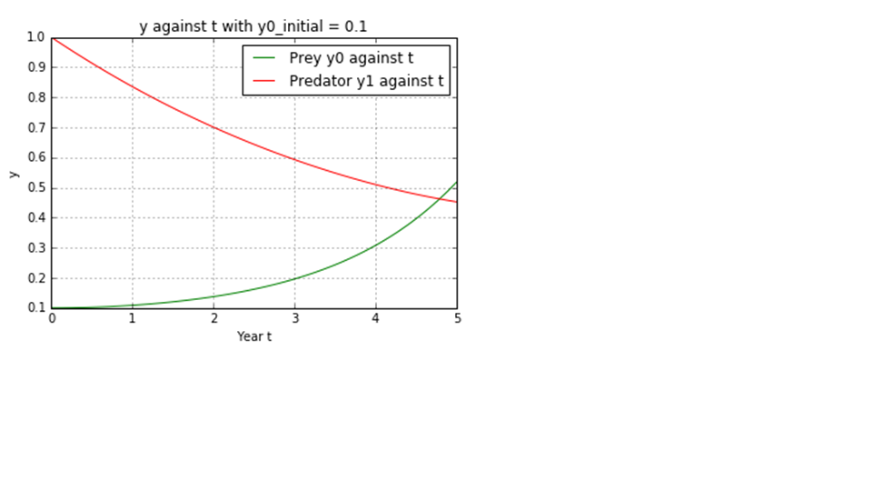
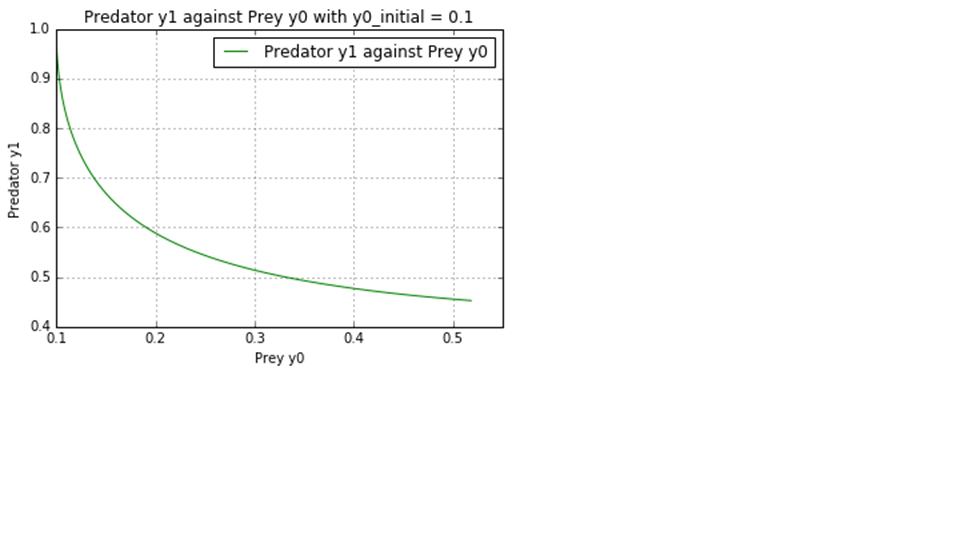
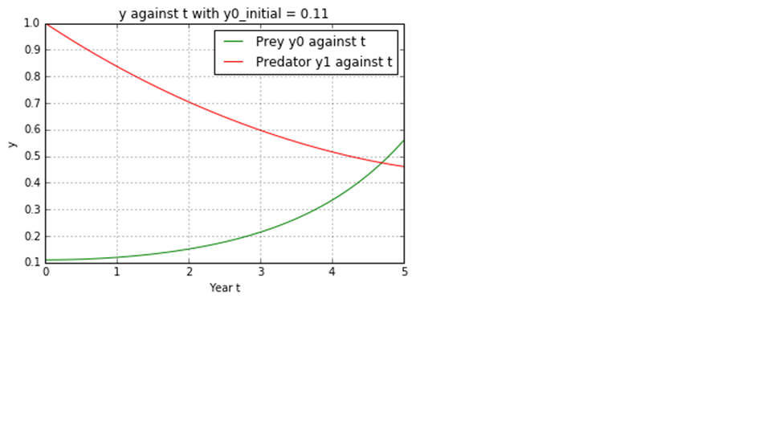
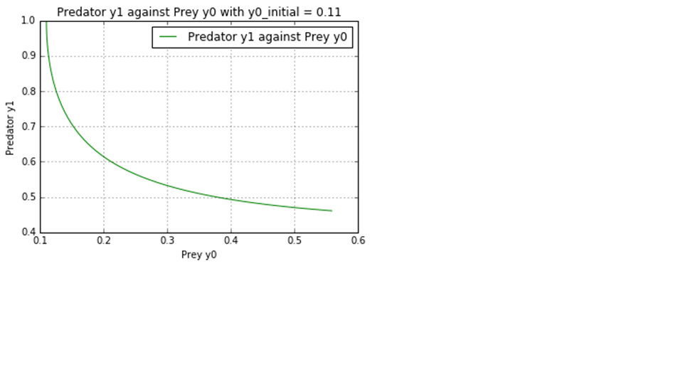

UECM3033 Assignment #3 Report
========================================================

- Prepared by: ** Yong Jun Ting**
- Tutorial Group: T3

--------------------------------------------------------

## Task 1 --  Gauss-Legendre formula

The reports, codes and supporting documents are to be uploaded to Github at: 

[https://github.com/JuntingYong/UECM3033_assign3](https://github.com/JuntingYong/UECM3033_assign3)

Explain how you implement your `task1.py` here.

First, in order to perform Gauss-Legendre quadrature, the interval [a,b] must be [-1,1]. Thus, Lagrange polynomial is used to transformed the interval to [-1,1] as follow: 
Implementation of codes: y = a*((x-1)/(-1-1)) + b*((x+1)/(1+1))  

Second, weights and nodes used in the Gauss-Legendre quadrature are obtained using Leggauss from module numpy.polynomial.legendre.
Implementation of codes: x,w = np.polynomial.legendre.leggauss(n) 

Finally, jacobian of the transformation which is (b-a)/2 times with the dots product of f(y) and w to compute the answer.
Implementation of codes: ans = ((b-a)/2) * np.dot(f(y),np.transpose(w))

Explain how you get the weights and nodes used in the Gauss-Legendre quadrature.

Polynomial module in the python is used to find the weights and nodes. The implementation of codes is as follow where weight and nodes are stored into variables x and w.
x,w = np.polynomial.legendre.leggauss(n)

---------------------------------------------------------

## Task 2 -- Predator-prey model

Explain how you implement your `task2.py` here, especially how to use `odeint`.
First, and ODE system is created while a differential equation dydt = [a*(y0 - y0*y1),b*(-y1 + y0*y1)] is created. 

Second, the given value is stored into a, b and y. 

Third, linspace function is used to plot a line graph from year 0 to year 5.
Implementation of codes: t = np.linspace(0, 5, 101)

Lastly, the nonlinear ODE system is solved using function odeint from the module scipy.integrate. 
Implementation of codes: sol = spIn.odeint(ode_system,y_initial,t,args=(a,b))

Put your graphs here and explain.

Graph of Prey y0 and Predator y1 against Year t is plotted. The initial condition is y0 = 0.1, y1 = 1.0. As the number of prey increase, the number of predator decreases.

Graph of Predator y1 against Prey y0 is plotted. The initial condition is y0 = 0.1, y1 = 1.0. Inverse relationship between y0 and y1 is observed.

Graph of Prey y0 and Predator y1 against Year t is plotted. The initial condition is y0 = 0.11, y1 = 1.0. As the number of prey increase, the number of predator decreases.

Graph of Predator y1 against Prey y0 is plotted. The initial condition is y0 = 0.11, y1 = 1.0. Inverse relationship between y0 and y1 is observed.

Is the system of ODE sensitive to initial condition? Explain.
When the initial value change from 0.1 to 0.11, there is no significance changes can be seen from the graph, only small changes. Thus, this system of ODE is not sensitive to the initial condition.

-----------------------------------

last modified: 17/04/2016
